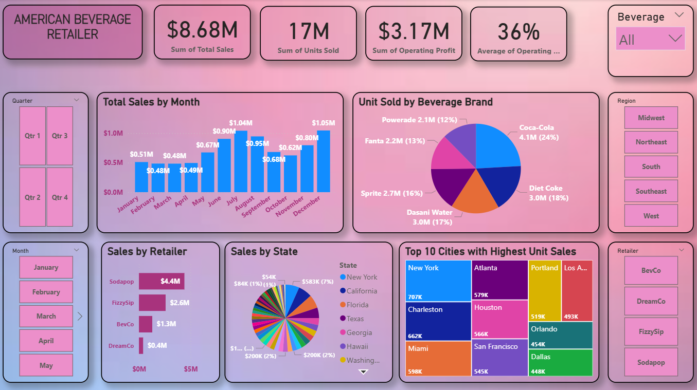

# 🧃 American Beverage Retailer Dashboard

This Power BI project provides a comprehensive analysis of a beverage retailer's performance using key metrics like total sales, units sold, operating profit, and brand-wise sales distribution.



## Project Files

- `P4_Retail_Store_Analysis.pbix`: Power BI dashboard file.
- `Coca-Cola Data.xlsx`: Source data for the report.
- `P4_dashboard.PNG`: Dashboard image for preview.

## Project Overview

This dashboard visualizes sales data of an American beverage retailer, helping stakeholders track key performance indicators such as:

- Monthly sales trends  
- Retailer-wise and state-wise sales performance  
- Units sold by beverage brand  
- Top-performing cities by unit sales  
- Operating profit and sales breakdown  
- Interactive filters for beverage type, region, retailer, month, and quarter

## Key Learnings

- Developed interactive and visually rich dashboards using **Power BI**
- Applied **Power Query** for data cleaning and transformation
- Created custom KPIs and insights using **DAX**
- Designed slicers and filters for dynamic interactivity
- Gained insights into beverage sales distribution across brands and regions

## Key Metrics

- **$8.68M** Total Sales  
- **17M** Units Sold  
- **$3.17M** Operating Profit  
- **36%** Average Operating Margin

## 🔧 Interactions

- **Month Selector:** Filter insights from January to December  
- **Region & Retailer Filters:** Drill down into specific segments  
- **Beverage Brand Breakdown:** Understand which brands drive the most sales  

---

## 📂 Repository

```bash
git clone https://github.com/ujjwalbabu0/Power_BI_Project_3_Retail_sales_analysis.git
